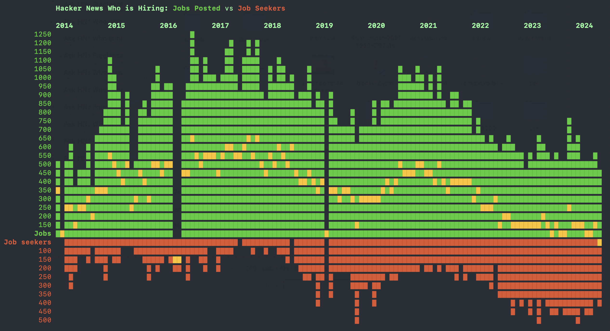

# HN who wants to be hired ratio

Each month since 2014 [whoishiring] on Hacker News has posted a couple of posts: "Who is hiring?" and "Who wants to be hired?", and for the most part each descendant comment is a job opening or a job seeker on the posts respectively.

This script outputs how many job seekers there are vs how many jobs.

Uses the official HN API: https://github.com/HackerNews/API?tab=readme-ov-file.


## Latest stats

October 2024:



[whoishiring]: https://news.ycombinator.com/user?id=whoishiring

## Usage

Requires Ruby.

```
bundle install
ruby main.rb
```